# Lab2 Kubernetes实践报告

小组分工：

    普昕：任务一二三

    谢升楼：任务四五

    肖羽平：任务六

## 1.使用minikube搭建kubernetes集群

运行 `minikube start --driver=docker`


## 2. 在Kubernetes集群中部署中间件

在gomall/k8s/middlewares中添加 Kubernetes manifests，包括 Redis、NATS 的 Deployment/Service， MySQL 的 ConfigMap、PV/PVC、StatefulSet、Service：

- nats-deployment.yaml -> NATS Deployment
- nats-service.yaml -> NATS Service
- mysqLconfigmap.yaml -> MySQL初始化 SQL
- mysqLpvpvc.yaml -> PersistentVolume 与PersistentVolumeClaim (hostPath)
- mysql-headless-service.yaml -> MySQL headless Service (StatefulSet 使用)
- mysql-service.yaml -> MySQL ClusterlP service
- mysql-statefulset.yaml -> MySQL StatefulSet(挂载 PVC 并使用 ConfigMap 初始化)

在集群中应用这些文件

```bash
minikube kubectl -- apply -f gomall/k8s/middlewares
```


运行 `minikube kubectl -- get po -A`，查看pod都处于Running状态，说明三个中间件的容器已经成功启动。


运行 ` minikube kubectl -- get svc -n default`，检查 `mysql`, `nats`, 和 `redis`已经创建了 `ClusterIP` 类型的 `Service`，说明它们可以在集群内部被访问。


运行 `minikube kubectl -- get cm -n default`，已经创建了 `mysql-init-sql`。

运行 `minikube kubectl -- describe statefulset mysql -n default` 的输出进一步确认了这个 `ConfigMap` 被正确挂载到了容器的 `/docker-entrypoint-initdb.d/init.sql` 路径，用于初始化。


综上，MySQL 已经实现了数据持久化。get pvc 显示已经创建了mysql-pvc 的 PersistentVolumeClaim，它的状态是 Bound，说明它成功绑定到了一个名为 `mysql-pv` 的 PersistentVolume。describe statefulset 确认了这个 mysql-pvc 被用作 mysql-data 卷，并挂载到了容器的 `/var/lib/mysql` 目录。

## 3. 在Kubernetes集群中部署gomall

**总体思路**

为每个微服务创建 `ConfigMap`（配置）、`Deployment`、`Service`、以及必要的 `Volume`/`PVC`，使得服务在集群内互相发现并稳定运行。

**要点**

- 微服务通过 `<中间件的服务名>:<端口号>` 访问中间件。在 `ConfigMap` 中把中间件地址设置为服务名：
  - MySQL: `address: mysql`、`port: 3306`
  - Redis: `address: "redis:6379"`
  - NATS: `url: "nats://nats:4222"`
- 使用 `ConfigMap` 存储微服务配置并挂载到容器中。每个微服务 YAML 文件顶部定义了一个 `ConfigMap`，并在 `Deployment.spec.template.spec.volumes` / `volumeMounts` 中以 `subPath` 的方式挂载到 conf.yaml。这样能在不重建镜像的情况下更新配置。

在集群中应用微服务清单

```bash
minikube kubectl -- apply -f gomall\k8s\microservices
```


运行 `minikube kubectl -- get pods -o wide`，可能会出现一些pod起不来的情况


运行 ` minikube kubectl -- logs cart-79f7f79fd9-rcchw`查看cart 日志，发现MySQL 还没有为 cart 等服务创建数据库并且授予 gomall 对这些数据库的权限。

优化一下

- 添加 mysql-init-job.yaml，等待 MySQL 就绪并执行创建数据库与授权的 SQL。
- 添加 mysql-secret.yaml 保存 MySQL 密码

现在可以了


运行 `kubectl port-forward service/frontend 8080:8080`

发现可以正常访问在 Kubernetes 集群中运行的 gomall 系统。


```bash
minikube kubectl -- apply -f .\gomall\k8s\middlewares\mysql-secret.yaml;
minikube kubectl -- apply -f .\gomall\k8s\middlewares\mysql-pv-pvc.yaml;
minikube kubectl -- apply -f .\gomall\k8s\middlewares\mysql-configmap.yaml;
minikube kubectl -- apply -f .\gomall\k8s\middlewares\mysql-headless-service.yaml;
minikube kubectl -- apply -f .\gomall\k8s\middlewares\mysql-statefulset.yaml;
minikube kubectl -- apply -f .\gomall\k8s\middlewares\redis-deployment.yaml;
minikube kubectl -- apply -f .\gomall\k8s\middlewares\redis-service.yaml;
minikube kubectl -- apply -f .\gomall\k8s\middlewares\nats-deployment.yaml;
minikube kubectl -- apply -f .\gomall\k8s\middlewares\nats-service.yaml;
minikube kubectl -- apply -f .\gomall\k8s\middlewares\mysql-init-job.yaml;
```


## 任务四：扩缩容与负载均衡实验

### 测试步骤执行记录

#### 1. 初始状态确认

- 初始副本数：1 个 Pod (`product-5454f95b79-7bxj2`)
- 状态：Running


#### 2. 扩容操作

```bash
minikube kubectl -- scale deployment/product --replicas=3
```


- 扩容后副本数：3 个 Pod
  - `product-5454f95b79-7bxj2` (原有)
  - `product-5454f95b79-rbdrk` (新增)
  - `product-5454f95b79-wrq6b` (新增)


#### 3. Hey性能测试结果

##### 扩容前

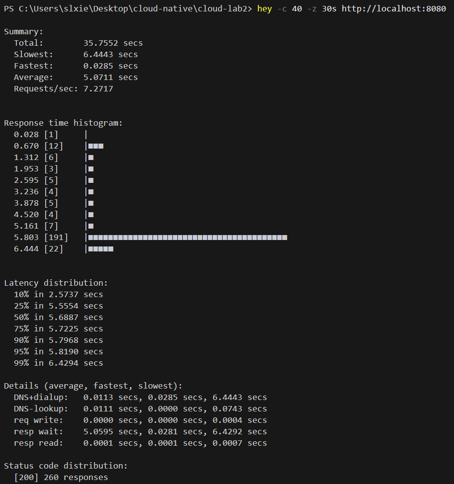

##### 扩容后


#### 4. 负载均衡验证结果

通过查看三个 Pod 的日志，确认所有 Pod 都在处理请求：

**Pod 1 (7bxj2)**: 日志显示大量 `ListProductsService:` 请求

**Pod 2 (rbdrk)**:日志显示大量 `ListProductsService:` 请求

**Pod 3 (wrq6b)**:日志显示大量 `ListProductsService:` 请求

**Service 端点验证**:

```
Endpoints: 10.244.0.15:8881,10.244.0.17:8881,10.244.0.16:8881
```

三个端点都已正确注册到 Service 中，负载均衡配置生效。


## 任务五：滚动更新实验报告

### 一 实验准备

#### 1.1 修改 product Deployment 配置

在 `gomall/k8s/microservices/product-deployment.yaml` 中添加：

##### 健康检查配置
```yaml
livenessProbe:
  tcpSocket:
    port: 8881
  initialDelaySeconds: 10  # 容器启动后10秒开始检查
  periodSeconds: 10         # 每10秒检查一次
  timeoutSeconds: 5         # 检查超时时间5秒
  failureThreshold: 3       # 连续失败3次判定为失败

readinessProbe:
  tcpSocket:
    port: 8881
  initialDelaySeconds: 5    # 容器启动后5秒开始检查
  periodSeconds: 5          # 每5秒检查一次
  timeoutSeconds: 3         # 检查超时时间3秒
  failureThreshold: 3       # 连续失败3次判定为失败
```

**说明**：
- **Liveness Probe（存活探针）**：检查容器是否存活，失败则重启容器
- **Readiness Probe（就绪探针）**：检查容器是否就绪，失败则从 Service 的负载均衡中移除
- 使用 **TCP Socket** 方式检查 gRPC 端口 8881 是否可连接

##### 滚动更新策略
```yaml
strategy:
  type: RollingUpdate
  rollingUpdate:
    maxUnavailable: 1  # 更新过程中最多1个 Pod 不可用
    maxSurge: 1        # 更新过程中最多新增1个 Pod
```

**说明**：
- **maxUnavailable: 1**：确保至少有 1 个 Pod 提供服务
- **maxSurge: 1**：控制资源使用，避免同时创建过多 Pod

##### 副本数调整
```yaml
replicas: 2
```

#### 1.2 应用配置

```bash
kubectl apply -f gomall\k8s\microservices\product-deployment.yaml
```

### 二、实验步骤与结果

#### 步骤 1：查看更新前状态

**命令**：
```bash
kubectl get deployment product -n gomall
kubectl get pods -n gomall -l app=product
```

**结果**：
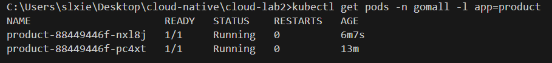

**说明**：
- 当前有 2 个 Pod 运行正常
- 使用的镜像版本：`buwandocker/product:lab2`
- 所有 Pod 状态为 Running，READY 为 1/1

---

#### 步骤 2：更新到故障镜像

**命令**：
```bash
kubectl set image deployment/product product=buwandocker/product:lab2-unhealthy -n gomall
```

**说明**：
- 故障镜像 `lab2-unhealthy` 不会监听 gRPC 端口 8881
- 这将导致健康检查失败

---

#### 步骤 3：观察滚动更新过程

**命令**
```bash
kubectl get pods -n gomall -l app=product
```

**结果**：
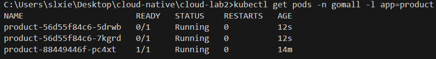

**分析**：
- 创建了 2 个新 Pod（故障镜像）
- 新 Pod 状态为 `0/1`，表示健康检查失败
- 保留了 1 个旧 Pod（正常镜像），继续提供服务
- **滚动更新被阻止**，因为新 Pod 健康检查未通过

---

#### 步骤 4：查看健康检查失败详情

**命令**：
```bash
kubectl describe pod product-56d55f84c6-5drwb -n gomall
```

**关键信息**：
```
  Warning  Unhealthy  8s (x4 over 68s)   kubelet            Liveness probe failed: dial tcp 10.244.0.92:8881: connect: connection refused
  Warning  Unhealthy  1s (x15 over 72s)  kubelet            Readiness probe failed: dial tcp 10.244.0.92:8881: connect: connection refused
```
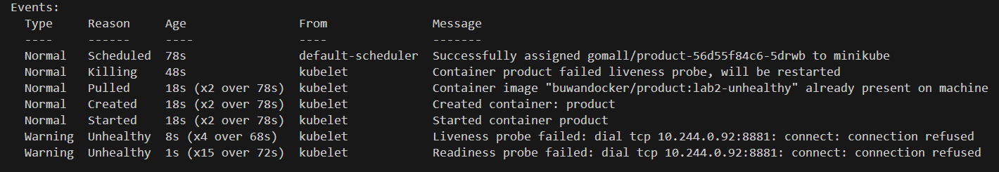

**说明**：
- **Liveness probe failed**：存活探针失败，连接被拒绝
- **Readiness probe failed**：就绪探针失败，Pod 不会接收流量
- 原因：故障镜像未监听 8881 端口

---

#### 步骤 5：查看 Deployment 更新状态

**命令**：
```bash
kubectl get deployment product -n gomall
kubectl rollout status deployment/product -n gomall --timeout=5s
```

**结果**：
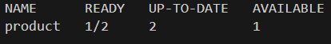
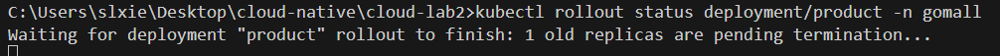

**分析**：
- **READY: 1/2**：只有 1 个 Pod 是健康的（旧版本）
- **AVAILABLE: 1**：只有 1 个 Pod 可用
- **更新被阻止**：因为新 Pod 健康检查失败，旧 Pod 无法终止

---

#### 步骤 6：查看所有 Pod 详细状态

**命令**：
```bash
kubectl get pods -n gomall -l app=product -o wide
```

**结果**：
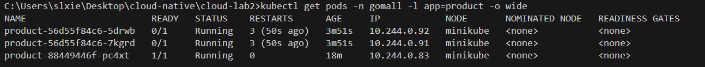

**说明**：
- 新 Pod（故障版本）：0/1，健康检查失败
- 旧 Pod（正常版本）：1/1，继续服务
- **服务未中断**：至少有 1 个健康的 Pod 提供服务

---

#### 步骤 7：执行回滚操作

**命令**：
```bash
kubectl rollout undo deployment/product -n gomall
```

**结果**：
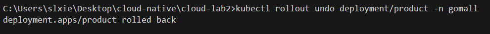

---

#### 步骤 8：观察回滚过程

**命令**（回滚5秒后）：
```bash
kubectl get pods -n gomall -l app=product
```

**结果**：
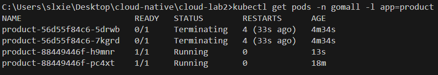

**分析**：
- 故障 Pod 正在终止（Terminating）
- 新的健康 Pod 已创建并运行（正常版本）
- 回滚过程正在进行

---

#### 步骤 9：等待回滚完成

**命令**：
```bash
kubectl rollout status deployment/product -n gomall
```

**结果**：


---

#### 步骤 10：验证回滚后的最终状态

**命令**：
```bash
kubectl get pods -n gomall -l app=product
kubectl get deployment product -n gomall -o jsonpath='{.spec.template.spec.containers[0].image}'
```

**结果**：
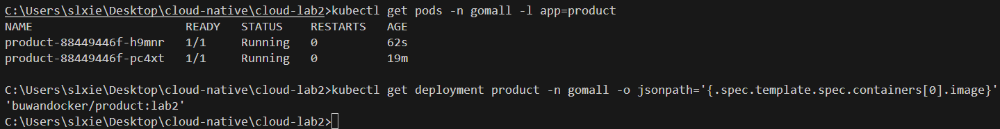

**验证结果**：
- 2 个 Pod 全部健康运行（2/2）
- 镜像版本已回滚到 `buwandocker/product:lab2`


---

#### 查看滚动更新历史

**命令**：
```bash
kubectl rollout history deployment/product -n gomall
```

**结果**：
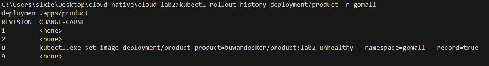


### 实验结论

本实验成功验证了 Kubernetes 滚动更新的以下特性：

1. **零停机更新**：通过健康检查和滚动更新策略，确保服务不中断
2. **自动故障检测**：健康检查失败时，自动阻止更新继续进行
3. **快速回滚**：发现问题后，可以使用一条命令快速回滚
4. **资源优化**：通过 maxUnavailable 和 maxSurge 控制更新过程中的资源使用


## 6.使用Helm Chart打包部署

使用scoop安装helm

按照任务二的实验过程部署中间件（要求中没有涉及中间件的打包）

将microservices中的每一个yaml文件的内容提取出一个模板写成对应的template

e.g.	 checkout.yaml将其中需要配置的参数抽取出来，值写在value.yaml中，在template中引用values.yaml的值。

每个资源都需要提取出一个模板（也可以只提取出一个通用的，但可能反而会变得更复杂）

模板提取完成后，将所有的值都分门别类的写入values.yaml.

然后在项目根目录下运行命令 `helm install gomall ./helm`

运行结果：

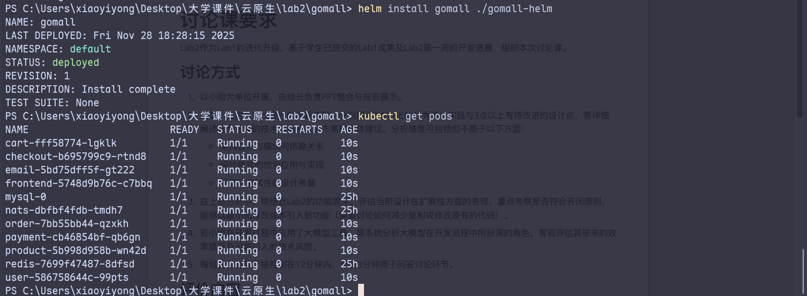

端口转发之后访问前端，服务都正常运行

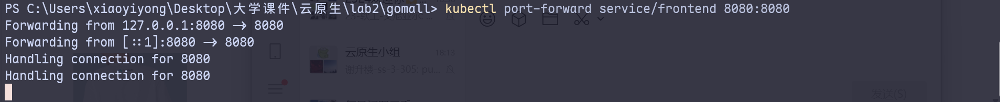


---
