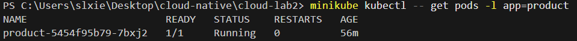
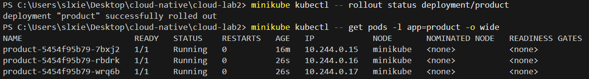
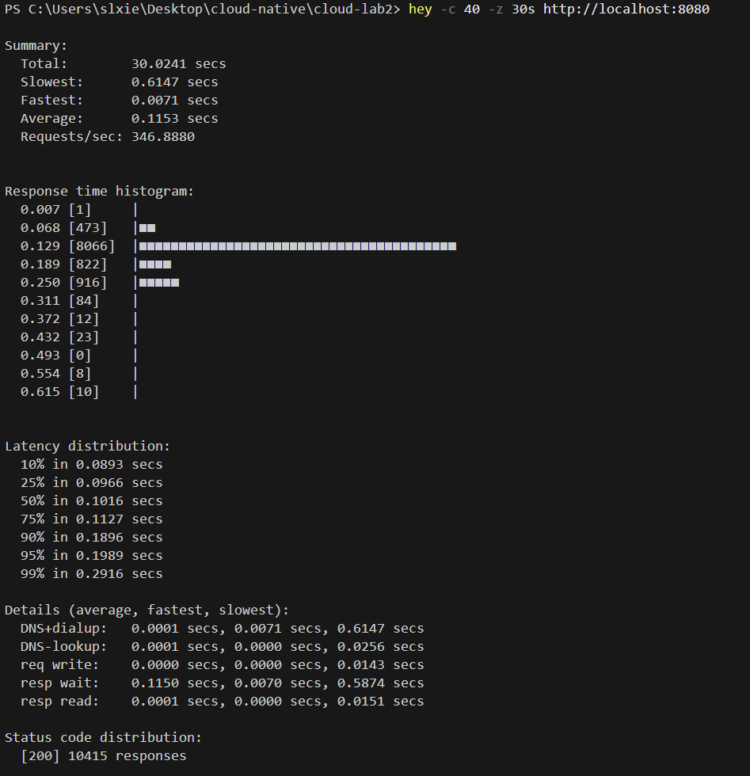
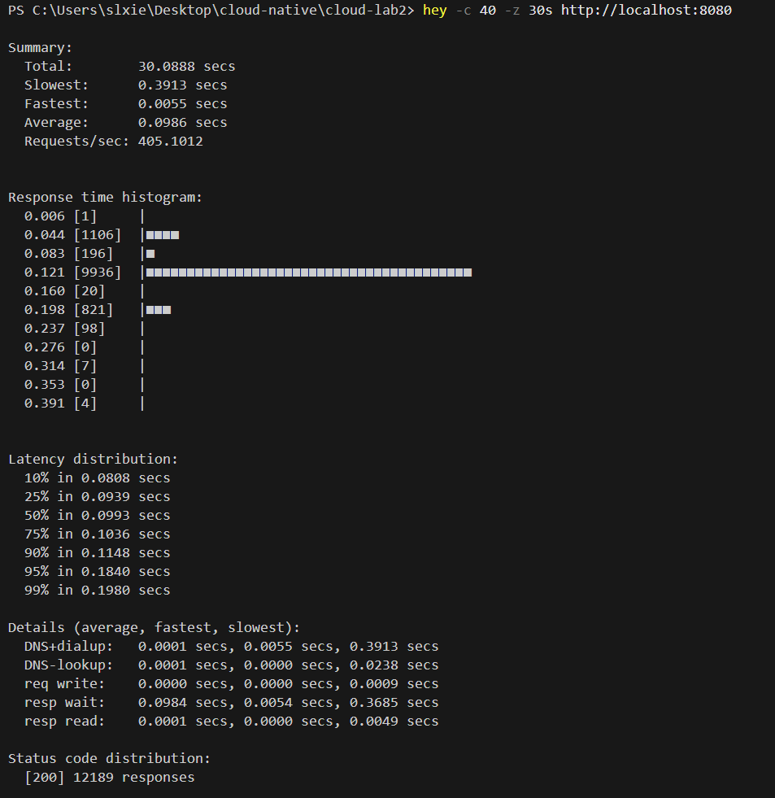
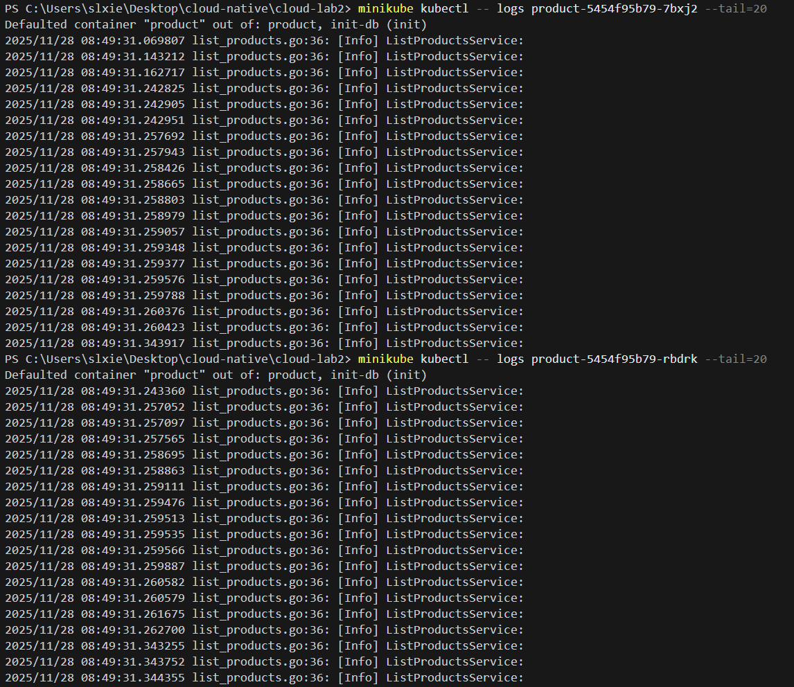
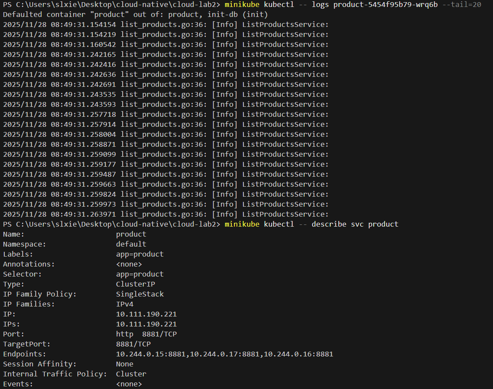

# Lab2 Kubernetes实践报告

小组分工：

    普昕：任务一二三

    谢升楼：任务四五

    肖羽平：任务六

## 1.使用minikube搭建kubernetes集群

运行 `minikube start --driver=docker`


## 2. 在Kubernetes集群中部署中间件

在gomall/k8s/middlewares中添加 Kubernetes manifests，包括 Redis、NATS 的 Deployment/Service， MySQL 的 ConfigMap、PV/PVC、StatefulSet、Service：

- nats-deployment.yaml -> NATS Deployment
- nats-service.yaml -> NATS Service
- mysqLconfigmap.yaml -> MySQL初始化 SQL
- mysqLpvpvc.yaml -> PersistentVolume 与PersistentVolumeClaim (hostPath)
- mysql-headless-service.yaml -> MySQL headless Service (StatefulSet 使用)
- mysql-service.yaml -> MySQL ClusterlP service
- mysql-statefulset.yaml -> MySQL StatefulSet(挂载 PVC 并使用 ConfigMap 初始化)

在集群中应用这些文件

```bash
minikube kubectl -- apply -f gomall/k8s/middlewares
```


运行 `minikube kubectl -- get po -A`，查看pod都处于Running状态，说明三个中间件的容器已经成功启动。


运行 ` minikube kubectl -- get svc -n default`，检查 `mysql`, `nats`, 和 `redis`已经创建了 `ClusterIP` 类型的 `Service`，说明它们可以在集群内部被访问。


运行 `minikube kubectl -- get cm -n default`，已经创建了 `mysql-init-sql`。

运行 `minikube kubectl -- describe statefulset mysql -n default` 的输出进一步确认了这个 `ConfigMap` 被正确挂载到了容器的 `/docker-entrypoint-initdb.d/init.sql` 路径，用于初始化。


综上，MySQL 已经实现了数据持久化。get pvc 显示已经创建了mysql-pvc 的 PersistentVolumeClaim，它的状态是 Bound，说明它成功绑定到了一个名为 `mysql-pv` 的 PersistentVolume。describe statefulset 确认了这个 mysql-pvc 被用作 mysql-data 卷，并挂载到了容器的 `/var/lib/mysql` 目录。

## 3. 在Kubernetes集群中部署gomall

**总体思路**

为每个微服务创建 `ConfigMap`（配置）、`Deployment`、`Service`、以及必要的 `Volume`/`PVC`，使得服务在集群内互相发现并稳定运行。

**要点**

- 微服务通过 `<中间件的服务名>:<端口号>` 访问中间件。在 `ConfigMap` 中把中间件地址设置为服务名：
  - MySQL: `address: mysql`、`port: 3306`
  - Redis: `address: "redis:6379"`
  - NATS: `url: "nats://nats:4222"`
- 使用 `ConfigMap` 存储微服务配置并挂载到容器中。每个微服务 YAML 文件顶部定义了一个 `ConfigMap`，并在 `Deployment.spec.template.spec.volumes` / `volumeMounts` 中以 `subPath` 的方式挂载到 conf.yaml。这样能在不重建镜像的情况下更新配置。

在集群中应用微服务清单

```bash
minikube kubectl -- apply -f gomall\k8s\microservices
```


运行 `minikube kubectl -- get pods -o wide`，可能会出现一些pod起不来的情况


运行 ` minikube kubectl -- logs cart-79f7f79fd9-rcchw`查看cart 日志，发现MySQL 还没有为 cart 等服务创建数据库并且授予 gomall 对这些数据库的权限。

优化一下

- 添加 mysql-init-job.yaml，等待 MySQL 就绪并执行创建数据库与授权的 SQL。
- 添加 mysql-secret.yaml 保存 MySQL 密码

现在可以了


运行 `kubectl port-forward service/frontend 8080:8080`

发现可以正常访问在 Kubernetes 集群中运行的 gomall 系统。


```bash
minikube kubectl -- apply -f .\gomall\k8s\middlewares\mysql-secret.yaml;
minikube kubectl -- apply -f .\gomall\k8s\middlewares\mysql-pv-pvc.yaml;
minikube kubectl -- apply -f .\gomall\k8s\middlewares\mysql-configmap.yaml;
minikube kubectl -- apply -f .\gomall\k8s\middlewares\mysql-headless-service.yaml;
minikube kubectl -- apply -f .\gomall\k8s\middlewares\mysql-statefulset.yaml;
minikube kubectl -- apply -f .\gomall\k8s\middlewares\redis-deployment.yaml;
minikube kubectl -- apply -f .\gomall\k8s\middlewares\redis-service.yaml;
minikube kubectl -- apply -f .\gomall\k8s\middlewares\nats-deployment.yaml;
minikube kubectl -- apply -f .\gomall\k8s\middlewares\nats-service.yaml;
minikube kubectl -- apply -f .\gomall\k8s\middlewares\mysql-init-job.yaml;
```

# 任务四、五测试结果总结

## 任务四: 在Kubernetes集群中部署gomall

### 文件列表

```
microservices/
├── 00-namespace.yaml            # Gomall 命名空间
├── cart-configmap.yaml          # Cart 配置
├── cart-deployment.yaml         # Cart 部署
├── cart-service.yaml            # Cart 服务
├── checkout-configmap.yaml      # Checkout 配置
├── checkout-deployment.yaml     # Checkout 部署
├── checkout-service.yaml        # Checkout 服务
├── email-configmap.yaml         # Email 配置
├── email-deployment.yaml        # Email 部署
├── email-service.yaml           # Email 服务
├── frontend-configmap.yaml      # Frontend 配置
├── frontend-deployment.yaml     # Frontend 部署
├── frontend-service.yaml        # Frontend 服务
├── order-configmap.yaml         # Order 配置
├── order-deployment.yaml        # Order 部署
├── order-service.yaml           # Order 服务
├── payment-configmap.yaml       # Payment 配置
├── payment-deployment.yaml      # Payment 部署
├── payment-service.yaml         # Payment 服务
├── product-configmap.yaml       # Product 配置
├── product-deployment.yaml      # Product 部署
├── product-service.yaml         # Product 服务
├── user-configmap.yaml          # User 配置
├── user-deployment.yaml         # User 部署
└── user-service.yaml            # User 服务
```

### 部署的微服务

| 服务名称 | 端口 | 状态    | 功能       |
| -------- | ---- | ------- | ---------- |
| cart     | 8883 | Running | 购物车管理 |
| checkout | 8884 | Running | 结账功能   |
| email    | 8888 | Running | 邮件发送   |
| order    | 8885 | Running | 订单管理   |
| payment  | 8886 | Running | 支付功能   |
| product  | 8881 | Running | 商品管理   |
| user     | 8882 | Running | 用户管理   |
| frontend | 8080 | Running | 前端页面   |

### 部署命令记录

#### 1. 创建命名空间和部署所有服务

```bash
kubectl apply -f gomall\k8s\microservices\
```

#### 2. 查看部署状态

```bash
# 查看所有 Pod
kubectl get pods -n gomall

# 查看所有 Service
kubectl get svc -n gomall
```


#### 3. 访问前端服务

```bash
kubectl port-forward service/frontend 8080:8080 -n gomall
```

然后在浏览器访问: http://localhost:8080
经过测试一切服务皆正常运作


---

## 任务五：扩缩容与负载均衡实验

### 测试步骤执行记录

#### 1. 初始状态确认

- 初始副本数：1 个 Pod (`product-5454f95b79-7bxj2`)
- 状态：Running



#### 2. 扩容操作

```bash
minikube kubectl -- scale deployment/product --replicas=3
```


- 扩容后副本数：3 个 Pod
  - `product-5454f95b79-7bxj2` (原有)
  - `product-5454f95b79-rbdrk` (新增)
  - `product-5454f95b79-wrq6b` (新增)



#### 3. Hey性能测试结果

##### 扩容前



##### 扩容后



#### 4. 负载均衡验证结果

通过查看三个 Pod 的日志，确认所有 Pod 都在处理请求：

**Pod 1 (7bxj2)**: 日志显示大量 `ListProductsService:` 请求

**Pod 2 (rbdrk)**:日志显示大量 `ListProductsService:` 请求

**Pod 3 (wrq6b)**:日志显示大量 `ListProductsService:` 请求

**Service 端点验证**:

```
Endpoints: 10.244.0.15:8881,10.244.0.17:8881,10.244.0.16:8881
```

三个端点都已正确注册到 Service 中，负载均衡配置生效。





## 6.使用Helm Chart打包部署

使用scoop安装helm

按照任务二的实验过程部署中间件（要求中没有涉及中间件的打包）

将microservices中的每一个yaml文件的内容提取出一个模板写成对应的template

e.g.	 checkout.yaml将其中需要配置的参数抽取出来，值写在value.yaml中，在template中引用values.yaml的值。

每个资源都需要提取出一个模板（也可以只提取出一个通用的，但可能反而会变得更复杂）

模板提取完成后，将所有的值都分门别类的写入values.yaml.

然后在项目根目录下运行命令 `helm install gomall ./helm`

运行结果：


端口转发之后访问前端，服务都正常运行


---
