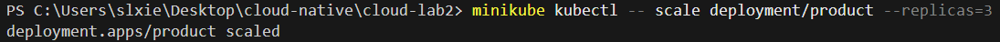

# 任务四、五测试结果总结

## 任务四: 在Kubernetes集群中部署gomall

### 文件列表
```
microservices/
├── 00-namespace.yaml            # Gomall 命名空间
├── cart-configmap.yaml          # Cart 配置
├── cart-deployment.yaml         # Cart 部署
├── cart-service.yaml            # Cart 服务
├── checkout-configmap.yaml      # Checkout 配置
├── checkout-deployment.yaml     # Checkout 部署
├── checkout-service.yaml        # Checkout 服务
├── email-configmap.yaml         # Email 配置
├── email-deployment.yaml        # Email 部署
├── email-service.yaml           # Email 服务
├── frontend-configmap.yaml      # Frontend 配置
├── frontend-deployment.yaml     # Frontend 部署
├── frontend-service.yaml        # Frontend 服务
├── order-configmap.yaml         # Order 配置
├── order-deployment.yaml        # Order 部署
├── order-service.yaml           # Order 服务
├── payment-configmap.yaml       # Payment 配置
├── payment-deployment.yaml      # Payment 部署
├── payment-service.yaml         # Payment 服务
├── product-configmap.yaml       # Product 配置
├── product-deployment.yaml      # Product 部署
├── product-service.yaml         # Product 服务
├── user-configmap.yaml          # User 配置
├── user-deployment.yaml         # User 部署
└── user-service.yaml            # User 服务
```

### 部署的微服务

| 服务名称 | 端口 | 状态 | 功能 |
|---------|------|------|------|
| cart | 8883 | Running | 购物车管理 |
| checkout | 8884 | Running | 结账功能 |
| email | 8888 | Running | 邮件发送 |
| order | 8885 | Running | 订单管理 |
| payment | 8886 | Running | 支付功能 |
| product | 8881 | Running | 商品管理 |
| user | 8882 | Running | 用户管理 |
| frontend | 8080 | Running | 前端页面 |

### 部署命令记录

#### 1. 创建命名空间和部署所有服务
```bash
kubectl apply -f gomall\k8s\microservices\
```

#### 2. 查看部署状态
```bash
# 查看所有 Pod
kubectl get pods -n gomall

# 查看所有 Service
kubectl get svc -n gomall
```


#### 3. 访问前端服务
```bash
kubectl port-forward service/frontend 8080:8080 -n gomall
```

然后在浏览器访问: http://localhost:8080
经过测试一切服务皆正常运作


---

## 任务五：扩缩容与负载均衡实验

### 测试步骤执行记录

#### 1. 初始状态确认
- 初始副本数：1 个 Pod (`product-5454f95b79-7bxj2`)
- 状态：Running


#### 2. 扩容操作
```bash
minikube kubectl -- scale deployment/product --replicas=3
```

- 扩容后副本数：3 个 Pod
  - `product-5454f95b79-7bxj2` (原有)
  - `product-5454f95b79-rbdrk` (新增)
  - `product-5454f95b79-wrq6b` (新增)


#### 3. Hey性能测试结果

##### 扩容前


##### 扩容后


#### 4. 负载均衡验证结果

通过查看三个 Pod 的日志，确认所有 Pod 都在处理请求：

**Pod 1 (7bxj2)**: 日志显示大量 `ListProductsService:` 请求

**Pod 2 (rbdrk)**:日志显示大量 `ListProductsService:` 请求

**Pod 3 (wrq6b)**:日志显示大量 `ListProductsService:` 请求

**Service 端点验证**:
```
Endpoints: 10.244.0.15:8881,10.244.0.17:8881,10.244.0.16:8881
```
三个端点都已正确注册到 Service 中，负载均衡配置生效。


---

